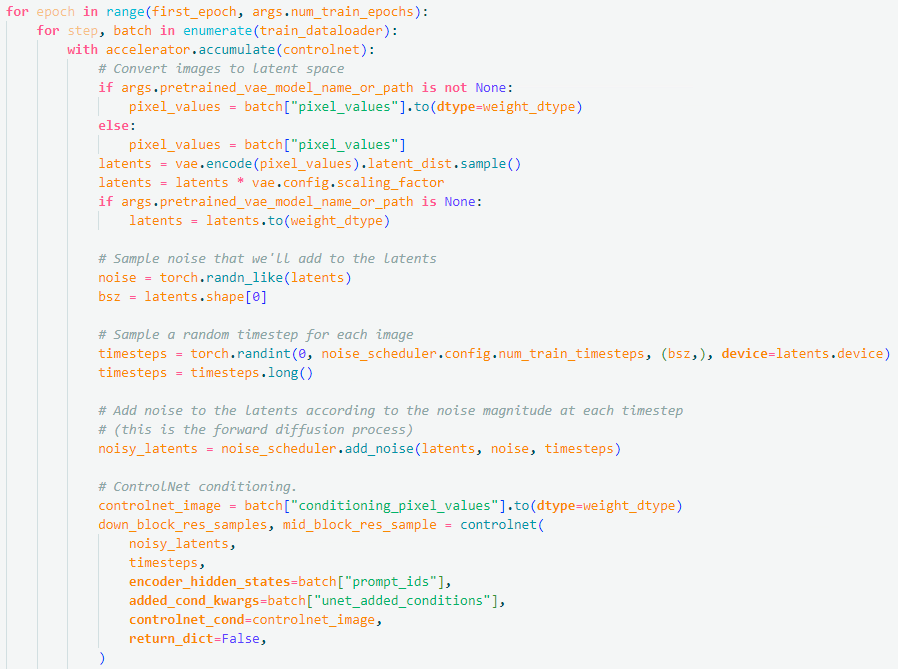

# 输入法皮肤生成{ignore=true}

[TOC]

## 1. 阶段1

### 😀 方案确定

- 确定方案为使用 Controlnet 控制图片生成

- 旨在达到图中效果，根据控制图片的规范生成图片的轮廓，细节交由模型自己生成


### 😀 方案验证

#### ⚙前期准备

- 环境配置
```sh
python = 3.10
torch = 1.13.1+cu117
pip install requirements.txt -r
```
or

copy kunhu10 conda创建的 `diff` 虚拟环境

- diffusion 基础模型为 stable-diffusion-xl-base-1.0
存储在 `/train21/intellQA/permanent/kunhu10/diffusers-main/base_models/stable-diffusion-xl-base-1.0`

- 图片 caption 模型 Blip 模型存储在 `/train21/intellQA/permanent/kunhu10/diffusers-main/base_models/blip-image-captioning-large`

#### 📕数据集准备

- 为了确定 [diffusers](https://github.com/huggingface/diffusers) (`diffusers-main/examples/controlnet/train_controlnet_sdxl.py`) 代码的可行性，使用 `fill50k` 数据集进行了验证

- 该数据集具有如下格式，目标图片，控制图片，以及文本描述文件 `train.jsonl`，如下

`{"text": "pale golden rod circle with old lace background", "image": "images/0.png", "conditioning_image": "conditioning_images/0.png"}`
&nbsp;&nbsp;

- 保存在 `/train21/intellQA/permanent/kunhu10/diffusers-main/dataset/controlnet/fill50k/`中，其中包括如下文件
```
-fill50k\
---conditioning_image\
---iamges\
---fill50k.py
---train.jsonl
```

- 由于数据下载在本地，对 `fill50k.py` 进行修改给定数据存储路径:


- 加载数据集时使用 `dataset` 中的 `load_dataset` 方法加载
```py
from datasets import load_dataset

dataset = load_dataset(train_data_dir)
```

#### 模型训练

- 对训练代码无需进行修改，只需要在脚本文件 `controlnet.sh` 文件中修改数据集路径 `train_data_dir` 为对应 `py` 文件位置，脚本文件位置 `/train21/intellQA/permanent/kunhu10/diffusers-main/controlnet.sh`


🤗**训练代码解释: train_controlnet_sdxl.py** 

- line 66-164: `def log_validation()`
  若在训练脚本中添加验证prompt以及conditioning_images，则在达到验证 step 时调用该函数，推理出图验证结果，并加载到 log 中
- line 166-184: `def import_model_class_from_model_name_or_path()`
  给定下载的模型权重路径，加载模型
- line 224-591: `def parse_args()` 
  定义命令行参数，除了训练的默认超参数外，需要注意给定了加载数据集时默认的列名称
  
  这与 `train.jsonl` 中各个数据键值对的名称对应
- line: 593-668: `def get_train_dataset()`
  使用 `load_dataset` 方法以及 `image_column` `text_column` `conditioning_column` 加载数据，返回初始数据集
  
- line 671-709: `def encode_prompt(prompt_batch,text_encoders)`
  此函数旨在将文本输入转换为 embedding，给定 batch 内的 prompt 文本， 使用 `text_encoder` 转换为文本特征
- line 711-745: `def prepare_train_dataset()`
  对数据集进一步处理，包括对 image 数据归一化以及转换为 tensor
  
- line 747-765: `def collate_fn()`
  加载 dataloader 的方法，给出了 batch 中存在 `pixel_values, conditioning_pixel_values, prompt_ids, unet_added_conditions` 
- line 767-1246: `main()` 函数
- line 807-887: 通过下载的模型权重加载模型如 `text_encoder`,`noise_scheduler`,`vae`,`unet`,`controlnet`, 并指定只训练 `controlnet` 部分的参数
  ```py
  vae.requires_grad_(False)
  unet.requires_grad_(False)
  text_encoder_one.requires_grad_(False)
  text_encoder_two.requires_grad_(False)
  controlnet.train()
  ```
- line 971-993: 定义了 `compute_embeddings()` 函数，使用 `encode_prompt()` 函数对文本部分计算 embeddings 并加载进数据集
  
- line 996-1026: 构建数据集以及用于训练的 dataloader
  
- line 1068-1116: prepare to train，print训练参数, 训练进程bar
- line 1117-1223: 加载 batch 内数据开始训练，随机选择一个 step，并预测该步的噪声，使用mse损失函数，以及反向传播过程
- 
  


## 2. 阶段2

### 😀 实验一：全键盘皮肤数据训练

#### 📕数据集准备

- 选取26键整个整盘的皮肤，统一 reshape 为 512×512 分辨率大小，并描边出conditioning_image 如下
 &nbsp;&nbsp;

- 描边方法使用轮廓检测方法，`cv2.Canny`，控制图片也要调整为同样大小分辨率，所有目标图片都使用了同一张控制图片
```py
import cv2
from PIL import Image
image = cv2.imread("./..")
low_threshold = 50
high_threshold = 80
canny_image = cv2.Canny(image,low_threshold,high_threshold)
```

- 所有数据存储在 `/train21/intellQA/permanent/kunhu10/diffusers-main/dataset/controlnet/keyboard_50/`,包含如下文件


- 其中 `keyboard_50.py` 中同样修改了`metadata_path`，`images_dir` 以及 `conditioning_images_dir`

- 对于图片的文本标签，使用 Blip 模型进行注释，将文本注释保存在 `train.jsonl` 中，实现
```py
from PIL import Image
from transformers import BlipProcessor, BlipForConditionalGeneration
import os
processor = BlipProcessor.from_pretrained("/train21/intell0A/permanent/kunhu10/diffusers-main/base_models/blip-image-captioning-large")
model = BlipForConditionalGeneration.from_pretrained("/train21/intellQA/permanent/kunhu10/diffusers-main/ \\
base_models/blip-image-captioning-large").to("cuda:0")

dataset_path = './dataset/controlnet/keyboard_102/images/'
image_list = []
text_list = []
for i in range(0,102):
    raw_image = Image.open(dataset_path + f'{i}.png')
    image_list.append(raw_image)
    text_list.append("a keyboard skin of")
inputs = processor(image_list, text_list, return_tensors="pt").to("cuda:2")
out = model.generate(**inputs)
import json
# 生成jsonl文件
output_json_path = './dataset/controlnet/keyboard_102/train.jsonl'
new_jsonl = []
# 遍历每一张图片的"image"
for i in range(len(out)):
    image_info = {"text": processor.decode(out[i], skip_special_tokens=True)+",iflyskin", "image": f"images/{i}.png",\\
    "conditioning_image": f"conditioning_images/{i}.png"}
    new_jsonl.append(image_info)
# 将jsonl数据写入到jsonl文件中
with open(output_json_path, 'w') as json_file:
    for image_info in new_jsonl:
        json_line = json.dumps(image_info, indent=None)
        json_file.write(json_line + '\n')
```
具体可参考 `/train21/intellQA/permanent/kunhu10/diffusers-main/caption.py` 文件


#### 模型训练

- 更改 `controlnet.sh` 中的数据集路径 `train_data_dir` 即可训练，训练代码不做修改

#### 实验结果

- `diffusers-main` 中封装好了用于推理步骤的 pipeline 用于生成图片，使用方法如下：
```py
from diffusers import StableDiffusionXLControlNetPipeline, ControlNetModel, UniPCMultistepScheduler
from diffusers.utils import load_image
import torch

base_model_path = "/train21/intellQA/permanent/kunhu10/diffusers-main/base_models/stable-diffusion-xl-base-1.0
controlnet_path = "/train21/intellQA/permanent/kunhu10/diffusers-main/saved_models/controlnet_sdxl/test_version_24/checkpoint-16000/controlnet"  # 待测试的controlnet保存位置
controlnet = ControlNetModel.from_pretrained(controlnet_path, torch_dtype=torch.float16) #加载controlnet
pipe = StableDiffusionXLControlNetPipeline.from_pretrained(
    base_model_path, controlnet=controlnet, torch_dtype=torch.float16
)
pipe.to("cuda")
# speed up diffusion process with faster scheduler and memory optimization
pipe.scheduler = UniPCMultistepScheduler.from_config(pipe.scheduler.config)
# remove following line if xformers is not installed or when using Torch 2.0
pipe.enable_xformers_memory_efficient_attention()
# memory optimization
pipe.enable_model_cpu_offload()
prompt = "a picture of ..."
control_image = load_image("....")
generator = torch.manual_seed(0)
image = pipe(
    prompt=prompt,image=control_image,num_inference_steps=20,generator=generator
).images[0]
```

- StableDiffusionXLControlNetPipeline 还支持包括tensor类型的text_embeds，以及image_embeds 等多种输入，输出类型也有 tensor, numpy_array, image 多种，具体可查看 `/train21/intellQA/permanent/kunhu10/diffusers-main/src/diffusers/pipelines/controlnet/pipeline_controlnet_sd_xl.py` 中定义的 `StableDiffusionXLControlnetPipeline`类

- 批量推理图片 `/train21/intellQA/permanent/kunhu10/diffusers-main/inferece.py` 中实现

- 在使用 50 张较好图片训练 3000 step 以及 6000 step 的结果如下
 &nbsp;&nbsp;


### 😀 实验二：分块键盘皮肤数据训练

#### 📕数据集准备

- 鉴于全键盘皮肤难以使用，提供数据中包括相当一部分将键盘皮肤切分成如下四块的新规范


🤗**使用同一 conditioning_image**

- 收集该类皮肤数据并统一大小，共收集 2000 张，保存于 `/train21/intellQA/permanent/kunhu10/diffusers-main/dataset/controlnet/keyboard2k` 中

- 在 `keyboard2k` 数据集下，使用的控制图片都是下面的 **同一张**，旨在通过同一张控制图片回归到不同的皮肤，增强皮肤生成的多样性


-  `/train21/intellQA/permanent/kunhu10/diffusers-main/dataset/controlnet/keyboard2k/keyboard2k.py` 对数据集路径已经进行了修改
  
- 由于 2k 张图片中大部分不同部分的图层叠加不正确，又重新筛选了对应关系较好的数据，共102张 (底图反映在预览图上，且具有键盘样式)，数据文件以及数据集构建方法在  `/train21/intellQA/permanent/kunhu10/diffusers-main/dataset/controlnet/keyboard_102/` 中

🤗**conditioning_image 渲染文字**

- 尝试在控制图片上渲染上目标图片的文字，达到生成皮肤中按要求出现文字的目的
- 使用 paddle OCR 检测出文本所在 box 以及文本，将准确度大于0.98 的文本渲染到统一的描边背景上
- 实现在 `/train21/intellQA/permanent/kunhu10/GlyphControl/ocr.py` 中，主体如下：

    - 其中 background_path 即统一描边背景图，若运行时 paddleocr 报错缺少 `.so` 文件等，考虑 `module load gcc/xxx` 和 `module load cuda/11.7`
    - 在离线状态下，paddleOCR 无法下载文本检测以及识别模型权重，需要手动下载，并更改 `tools/infer/utilify.py` 中的参数，具体参考(https://blog.csdn.net/weixin_47151919/article/details/122066480)
  

- 渲染文字后的描边图构建的数据集保存在`/train21/intellQA/permanent/kunhu10/diffusers-main/dataset/controlnet/keyboard_102/` 中

#### 模型训练

- 训练代码不做修改，训练脚本中注意更改分辨率参数 `--resolution`
- 如果是微调实验只需在训练脚本参数中加上 `--controlnet_model_name_or_path` ，为微调的基础模型路径
- 按照不同 conditioning_image 以及不同分辨率进行了一系列实验

实验编号     | type | dataset-size |conditioning-image | resolution | 备注 |
--------    | -----| -----         |-----              |-----      |----- |
1  | 从头训练 | 2k |  所有数据使用同一控制图 | 512 | 多样性较好，图层叠加不对应|
2  | 从头训练 | 102 | 所有数据使用同一控制图| 512 | 图层叠加对应，训练到稳定结构后理解文本差|
3  | 微调 Canny | 102 | 所有数据使用同一控制图 | 512 |
4  | 从头训练   | 102 | 每张控制图渲染对应文字| 1024 |
5  | 微调 Canny | 102 |每张控制图渲染对应文字| 1024|结构稳定文本理解较好，多样性一般|

#### 实验结果

- 符合基本键盘规范，模型学习到相关结构布局信息
     &nbsp;&nbsp;


## 3. 阶段3

### 😀 实验一：关键键盘元素布局皮肤

- 为了进一步适应使用需求，要求皮肤布局仅需要关键元素如导航栏，功能键，26键，9键背景等，如下图
  

#### 📕 数据准备

- 从皮肤商城以及社区皮肤中筛选了部分可用数据，这些皮肤是按照协议组合各个元素图片而成，对于每个键盘皮肤，有如下文件夹，包含了各个键的图片文件
  
- 这些文件夹统一保存在 `/train21/intellQA/permanent/kunhu10/GlyphControl/image_path_folder/` 中
- 布局这些元素到同一张画布上，制定了一定的规则 (各个功能键的在画布上的位置)，主要实现在 `load_image` 函数中，定义了每个按键元素的大小以及位置
- 实现方式在 `/train21/intellQA/permanent/kunhu10/GlyphControl/merge_image.py` 中
    
- 经过两次提取，一共得到 332 张可用皮肤，conditioning_images 以及文本标签等按照之前方法创建，保存在 `/train21/intellQA/permanent/kunhu10/diffusers-main/dataset/controlnet/keyboard_332_512/` 以及  `/train21/intellQA/permanent/kunhu10/diffusers-main/dataset/controlnet/keyboard_332_1024/` 中，二者分辨率不同
    

#### 模型训练

- 训练方式与之前相同，当训练 1024×1024 的图像时，需使用 80GB 显卡
- 多卡并行训练是通过 accelerate 实现的，设置参数时，在命令行 `accelerate config` 进行选择或者在`home`目录下更改 `.cache/huggingface/accelarate/defaut_config.yaml` 文件，如修改为8卡并行的配置如下
  ```sh
  compute_environment: LOCAL_MACHINE
    distributed_type: MULTI_GPU
    downcast_bf16: 'no'
    gpu_ids: all
    machine_rank: 0
    main_training_function: main
    mixed_precision: 'no'
    num_machines: 1
    num_processes: 8
    rdzv_backend: static
    same_network: false
    tpu_env: []
    tpu_use_cluster: false
    tpu_use_sudo: false
    use_cpu: false
  ```

#### 实验结果
- 与预期符合，布局规范，但是图片中文本部分仍然存在问题
  &nbsp;&nbsp;&nbsp;&nbsp;&nbsp;&nbsp;&nbsp;&nbsp;&nbsp;&nbsp;&nbsp;&nbsp;&nbsp;&nbsp;&nbsp;&nbsp;&nbsp;&nbsp;


### 😀 实验二：添加ctc-loss监督图片中的文本生成

#### 📕 数据准备

- 监督是否生成可识别文本，数据中需包含正确文本的标签以及图片中文本所在区域信息
- 在 `train.jsonl` 文件中进行了修改，此时每一行为如下键值对，保存在 `/train21/intellQA/permanent/kunhu10/diffusers-main/dataset/controlnet/keyboard_332_512/`
  ```
  {"text":"a picture of a girl with long hair, iflyskin, writing \"前往 \","image":"images/0.png",
  "conditioning_image":"conditioning_images/0.png",
  "box":[[[430.0,174.0],[450.0,174.0],[450.0,186.0],[430.0,186.0]]]}
  ```

- 对数据集加载方法 (`/train21/intellQA/permanent/kunhu10/diffusers-main/dataset/controlnet/keyboard_332_512/keyboard_332_512.py`) 进行修改，添加新的数据格式多维数组
   

- 对于数据集准备以及加载dataloader的部分进行修改，保存于 `/train21/intellQA/permanent/kunhu10/diffusers-main/train_controlnet_sdxl_own.py` 中
- 修改 `prepare_train_dataset` 函数中 `process_train` 如下：
  
- 修改 `collate_fn` 函数如下：
   
  其中 `gt_text,text_length,box` 是每条数据新增的输入类型，分别表示ground-truth的文本标签，文本长度以及文本框位置，用于监督文本生成

#### 模型训练

🤗`train_controlnet_sdxl_own.py` **修改**
- 添加用于ppocr识别的字典，即使用一个保存了常见汉字符的文本文件创建dict
  
- 初始化了用于文本识别的ppocr模型，其相关实现以及模型权重保存在 `/train21/intellQA/permanent/kunhu10/diffusers-main/Anytext/` 中, `text_recognizer` 用于后续在训练过程中对监督推理图片中的文本部分
  
- 在训练过程中边训练边推理当前模型的出图结果，使用 `infer_img` 函数实现推理过程
  
  给定当前 `batch` 以及 `vae`,`unet` (冻结) 以及 `controlnet` (训练) 模型，即可得到输出 images tensor
- 计算 ctc_loss 的实现在`/train21/intellQA/permanent/kunhu10/diffusers-main/Anytext/recognizer.py` 中。本实验中使用 `OCR_ctcloss` 函数接收预测图片以及标签计算损失
  
 
- 一次forward 计算 `loss_ctc` 的过程如下
  ```py
  for epoch in range(first_epoch,args.num_train_epochs):
        for step,batch in enumerate(train_dataloader):
            infer_images = infer_img(args,accelerator,noise_scheduler,vae,unet,controlnet,weight_dtype,batch)
            preds,loss_text = OCR_ctcloss(infer_images,text_recognizer,bacth)
            loss_text = loss_text.to(accelerator.device)
  ```
- 模型训练脚本文件保存为 `/train21/intellQA/permanent/kunhu10/diffusers-main/controlnet_own.sh`

#### 实验结果

- loss_text 难以下降


## 4. 后续

- 增加数据集大小从头训练，数百个数据相对较少
- 文本损失难以优化，关注后续 [Anytext](https://github.com/tyxsspa/AnyText) 开源后，参考实现方式
- SD3 使用 transformer 替代 Unet backbone, 对文本生成友好，关注后续实现工作


